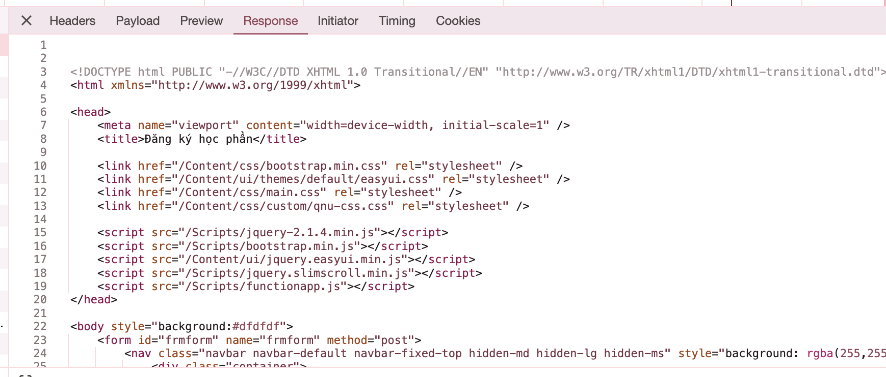
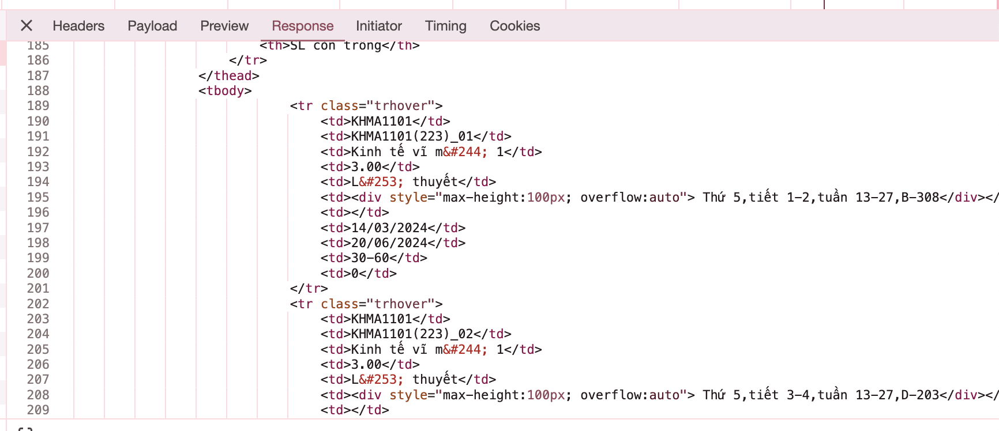
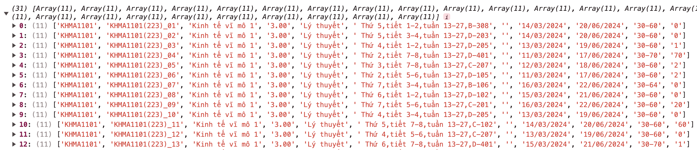

# CÁCH THỨC HOẠT ĐỘNG CỦA TOOL TỰ ĐỘNG ĐĂNG KÝ TÍN NEU

Trong bài viết này, tôi sẽ trình bày về cách thức hoạt động của tool tự động đăng ký tín trên trang tinchi.neu.edu.vn một cách chi tiết để đảm bảo/chứng minh rằng, tool này **KHÔNG** vi phạm hay xâm nhập trái phép vào bất cứ cơ sở dữ liệu hay hệ thống nào của trường Đại học Kinh tế Quốc dân.

## MỤC LỤC

1. [Công nghệ sử dụng](#công-nghệ-sử-dụng)
   1. [Chrome Extensions API](#chrome-extensions-api)
   2. [HTML - CSS - Javascript](#html---css---javascript)
3. [Lấy dữ liệu người dùng](#1-lấy-dữ-liệu-người-dùng)
4. [Lấy dữ liệu về các lớp học phần có sẵn](#2-lấy-dữ-liệu-về-các-lớp-học-phần-có-sẵn-tra-cứu-học-phần)
5. [Thực hiện tự động đăng ký tín](#3-thực-hiện-tự-động-đăng-ký-tín)
6. [Tổng kết](#tổng-kết)

## CÔNG NGHỆ SỬ DỤNG<a name="technology"></a>

### Chrome Extensions API<a name="ceapi"></a>

Chrome Extensions API (CEAPI) là một tập hợp các giao diện lập trình ứng dụng (API) được cung cấp bởi Google cho phép nhà phát triển tạo ra các tiện ích mở rộng (extensions) cho trình duyệt web Google Chrome. API này cung cấp các phương thức để tương tác với các phần của trình duyệt như tab, window, bookmarks, cookies, và nhiều tính năng khác.

Với Chrome Extensions API, nhà phát triển có thể tạo ra các tiện ích mở rộng có thể thay đổi hoặc mở rộng tính năng của trình duyệt Chrome, cho phép người dùng tùy chỉnh trải nghiệm duyệt web của họ theo cách mong muốn. Điều này bao gồm việc thêm chức năng mới, tích hợp với các dịch vụ ngoại tuyến khác như Google Drive hoặc các ứng dụng trực tuyến khác, hoặc thậm chí thay đổi giao diện của trình duyệt.

Đối với tool đăng ký tín chỉ này, tôi sử dụng CEAPI, cụ thể, tool này sử dụng các tính năng sau:

- Đọc/Ghi Cookies
- Lấy dữ liệu các tabs đang mở

### HTML - CSS - Javascript<a name="htmlcssjs"></a>

Tool này sử dụng HTML và CSS thuần để xây dựng giao diện, sử dụng Javascript để thực hiện phát triển chức năng. Lưu ý rằng, không cần thêm/gắn Chrome Extensions API reference vào HTML hay import vào Javascript vì khi extensions được load vào trình duyệt, nghĩa là tool đang chạy trên môi trường của Chrome rồi, CEAPI sẽ tự động có sẵn mà không cần import.

## 1. LẤY DỮ LIỆU NGƯỜI DÙNG<a name="userdata"></a>

Như đã khẳng định từ trước, tool này không gửi các yêu cầu trái phép hay xâm nhập bất hợp pháp vào bất kỳ cơ sở dữ liệu hay hệ thống nào của trường Đại học Kinh tế Quốc dân, do đó, người dùng vẫn phải đăng nhập vào trang tinchi.neu.edu.vn bình thường để tool này gửi các yêu cầu **trên danh nghĩa** người dùng đã đăng nhập trước đó.

Với hệ thống tinchi của ĐH Kinh tế Quốc dân, khi gửi bất kỳ yêu cầu gì lên máy chủ cần có một trường <code>userID</code> (chính là mã sinh viên) đính kèm để hệ thống xác thực **ai là người đang gửi yêu cầu**. Sau khi đã đăng nhập, một biến tên <code>userID</code> sẽ được lưu vào trong cookies.

Tôi sử dụng CEAPI với quyền truy cập cookies để đọc và lấy <code>userID</code> ra để sử dụng.

```javascript
function initCookie() {
  chrome.tabs.query(
    {
      status: "complete",
      // SET môi trường hoạt động sẽ là tab đang mở tool (trang tinchi.neu.edu.vn)
      // Nếu trang hiện tại không phải trang đăng ký tín NEU, sẽ có thông báo rằng "Đây không phải trang tinchi.neu.edu.vn"
      windowId: chrome.windows.WINDOW_ID_CURRENT,
      active: true,
    },
    function (tab) {
      chrome.cookies.getAll({ name: "UserID" }, function (cookie) {
        // Lấy dữ liệu của trường có key là UserID từ Cookies ra
        sessionStorage.setItem("MSV", cookie[0].value); // Lưu lại để sử dụng sau này
        update();
      });
    }
  );
}
```

## 2. LẤY DỮ LIỆU VỀ CÁC LỚP HỌC PHẦN CÓ SẴN (TRA CỨU HỌC PHẦN)<a name="search"></a>

Ở phiên bản trước (1.0.0) của tool này, người dùng phải **tự nhập tay** các lớp học phần cần đăng ký. Tuy nhiên, để tăng tính hiện đại, tự động và dễ sử dụng, tôi đã phát triển một phần tra cứu dữ liệu các lớp học phần để người dùng thêm vào danh sách cần đăng ký cho tiện. Thực chất của chức năng này chính là chức năng 'Tra cứu học phần' có sẵn của trang tinchi.neu.edu.vn.

Để lấy danh sách các lớp học phần có sẵn, tôi mô phỏng lại chức năng 'Tra cứu học phần' bằng cách gửi một <code>POST</code> request lên địa chỉ <code>https://tinchi.neu.edu.vn/TraCuuHocPhan</code>. Đồng thời, nội dung (<code>body</code>) của request này cần 03 trường dữ liệu sau:

- <code>ddlMonHoc</code> _(giá trị mặc định là 1)_: Loại tìm kiếm (Tìm kiếm bằng mã học phần hay tên học phần. Với giá trị mặc định 1 thì là tìm bằng tên học phần)
- <code>txtSearch</code>: Giá trị chuỗi cần tìm. Ví dụ tôi để <code>txtSearch</code> là "vĩ mô" thì hệ thống sẽ trả lại kết quả cho tôi danh sách các lớp học phần của các môn học có chứa chữ "vĩ mô"
- <code>btnTim</code> _(giá trị mặc định là "Tìm kiếm")_: Tôi cũng không biết cái trường này để làm gì nữa.
  Phần <code>body</code> này phải được gửi lên dưới dạng <code>x-www-form-urlencoded</code>

```javascript
// Các dữ liệu sẽ được mã hoá x-www-form-urlencoded để gửi lên server
var details = {
  ddlMonHoc: "1", // Mặc định tìm kiếm bằng tên học phần
  txtSearch: document.getElementById("subjectSearchInput").value, // Đọc giá trị từ một ô input
  btnTim: "Tìm kiếm",
};

// Phần này mã hoá dữ liệu bên trên thành dạng x-www-form-urlencoded
var formBody = [];
for (var property in details) {
  var encodedKey = encodeURIComponent(property);
  var encodedValue = encodeURIComponent(details[property]);
  formBody.push(encodedKey + "=" + encodedValue);
}
formBody = formBody.join("&");

// Gửi request POST lên server
fetch("https://tinchi.neu.edu.vn/TraCuuHocPhan", {
  method: "POST",
  body: formBody,
  headers: {
    "Content-type": "application/x-www-form-urlencoded;charset=UTF-8", // Set loại dữ liệu là x-www-form-urlencoded, bộ mã hoá là UTF-8 để hỗ trợ các ký tự Tiếng Việt
  },
});
```

Sau khi gửi yêu cầu này lên máy chủ với từ khoá tìm kiếm là "vĩ mô", tôi được máy chủ trả về cho một phản hồi (response) có dạng như sau:

Thế danh sách các lớp học phần ở đâu? Kéo xuống một chút ta sẽ thấy chúng nằm ở đây:

Như bạn thấy, dữ liệu này vẫn đang ở dạng HTML, không phải ở các dạng dữ liệu dễ đọc như XML hay JSON, do đó, tôi làm thêm một bước là bước lọc sạch dữ liệu để lấy ra thông tin về các lớp học phần này.
Trước hết, tôi phát hiện rằng, mọi thông tin đều nằm trong một bảng <code>< table class="table table-hover" ></code>. Vì vậy, việc đầu tiên là tôi sẽ cắt riêng cái bảng này ra khỏi HTML nhận được từ máy chủ:

```js
// biến res là response nhận được từ server
var startIndex = res.indexOf('<table class="table table-hover">');
var endIndex = res.indexOf("</table>");
res.substring(startIndex, endIndex); // Lấy ra chuỗi trong HTML phản hồi từ server từ đoạn '<table class="table table-hover">' đến khi đóng thẻ table '</table>'
```

Tiếp theo, tôi chuyển <code>< table ></code> trên từ dạng chuỗi thành một <code>HTMLElement</code> đích thực để dễ dàng làm việc. Để làm được điều này, tôi tạo một element div giả, sau đó, gán chuỗi đã cắt trên vào element này.

```js
var tempDiv = document.createElement("div");
tempDiv.innerHTML = res.substring(startIndex, endIndex);
```

Như vậy, khi làm việc, tôi chỉ cần làm việc với element <code>tempDiv</code> mà không cần phải làm việc với một chuỗi (string) dữ liệu thông thường nữa.
Tiếp tục, từ <code>table</code> đó, tôi thấy rằng các bộ dữ liệu đều đươc gói trong một thẻ <code>< tr class="trhover" ></code>, vì vậy, tôi viết mã để lấy tất cả các <code>tr</code> này ra:

```js
var query = tempDiv.querySelectorAll(".trhover");
```

sau đó, đọc dữ liệu nằm trong các thẻ <code>td</code> của các <code>tr</code> này:

```js
var data = []; // Mảng data để lưu toàn bộ thông tin của các lớp học phần tra cứu được

var query = tempDiv.querySelectorAll(".trhover");
for (var i = 0; i < query.length; i++) {
  // Lặp từng thẻ <tr>. Mỗi thẻ <tr> ứng với một lớp học phần.
  var tr = query[i];
  var trQuery = tr.querySelectorAll("td"); // Lấy các thẻ <td> nằm trong thẻ <tr> hiện tại

  var object = []; // Mảng object để lưu các dữ liệu của lớp học phần hiện tại

  for (var j = 0; j < trQuery.length; j++) {
    object.push(trQuery[j].innerText); // Đọc dữ liệu nằm bên trong các thẻ td và đẩy vào mảng object
  }

  data.push(object); // Đẩy dữ liệu lớp học phần hiện tại vào mảng data
}
```

Kết quả thu được

Như vậy, tôi đã lọc được dữ liệu về thông tin các lớp học phần từ phản hồi của server. Các thông tin này sẽ được dùng để hiển thị lên màn hình thông qua một thẻ <code>< table ></code> khác, bạn đọc có thể tham khảo trong file code <code>script.js</code> từ dòng 105 - 162.

## 3. THỰC HIỆN TỰ ĐỘNG ĐĂNG KÝ TÍN<a name="dowork"></a>

Sau khi người dùng đã thêm các môn cần đăng ký, tôi thực hiện gửi yêu cầu đăng ký các học phần này lên máy chủ của Đại học Kinh tế Quốc dân.

Việc gửi này rất đơn giản, tôi sẽ liên tục gửi yêu cầu đăng ký lên máy chủ (1 lần/s) cho đến khi nhận được phản hồi từ máy chủ. Lý do cần gửi liên tục là do:

1. Khi thực hiện đăng ký tín, có thể máy chủ của trường sẽ bị lag/nghẽn/hết băng thông, do đó, dễ rơi vào trường hợp yêu cầu bị quá thời gian (timeout) mà không nhận được bất kỳ phản hồi nào từ máy chủ. Do đó, xác suất nhận được phản hồi từ máy chủ là không chắc chắn, do vậy, cần gửi liên tục nhiều lần.
2. Để hỗ trợ thêm trường hợp lớp tín chỉ người dùng muốn đăng ký đã **hết slot trống**. Hệ thống vẫn sẽ tiếp tục gửi yêu cầu đăng ký lên máy chủ, để **ngay khi lớp tín chỉ đó có slot trống, yêu cầu đăng ký sẽ lập tức được thực hiện (tức là nhảy vào đăng ký lớp đó ngay)**

Vấn đề gửi liên tục này sẽ **KHÔNG** ảnh hưởng đến máy chủ của Đại học Kinh tế Quốc dân do hệ thống máy chủ của trường có một **hàng chờ** yêu cầu. Các yêu cầu sẽ được xử lý lần lượt. Thông thường, khi không đông người đăng ký, các yêu cầu gần như sẽ được xử lý ngay lập tức nên sẽ không phải gửi quá nhiều yêu cầu; còn trong trường hợp máy chủ đang nghẽn/lag, các yêu cầu có thể sẽ bị huỷ do server không thể xử lý, dẫn đến tình trạng timeout tôi vừa đề cập bên trên.

Quay lại với phần viết mã, địa chỉ nhận yêu cầu đăng ký tín của ĐH Kinh tế Quốc dân có dạng:

```
https://tinchi.neu.edu.vn/DangKyHocPhan/DangKy?Hide={ARG_1}$0.0${ARG_2}$$0&acceptConflict=true&classStudyUnitConflictId=&RegistType=KH
```

Trong đó, các tham số <code>ARG_1</code> và <code>ARG_2</code> lần lượt là **mã lớp học phần** và **mã học phần** muốn đăng ký (sẽ được lấy từ danh sách lớp học phần mà người dùng thêm vào từ phần Tra cứu học phần trình bày bên trên). Ngoài ra, URL này còn có các tham số ở đằng sau bao gồm:

- <code>acceptConflict</code>: Chấp nhận mâu thuẫn lớp học phần. Tức là cùng học phần đó, nếu đã đăng ký một lớp A rồi, bây giờ muốn đăng ký một lớp B khác thì lớp A đó sẽ tự động bị huỷ để đăng ký lớp B.
- <code>classStudyUnitConflictId</code>: Tôi không rõ chức năng là gì.
- <code>RegistType</code>: Loại hình đăng ký. Mặc định là KH, nghĩa là theo Kế hoạch. Ngoài KH ra, tôi không biết còn loại nào khác nữa, do vậy, để nguyên là KH. (Bình thường các yêu cầu đăng ký khi sinh viên thực hiện đăng ký bằng tay gửi lên cũng là KH)

03 tham số này tôi để mặc định như khi đăng ký bằng tay để đảm bảo giống với hành động đăng kí của sinh viên nhất, tránh các lỗi và vấn đề phát sinh không cần thiết.

Ví dụ, tôi muốn đăng ký lớp học phần số 09 của môn học Kinh tế vĩ mô (<code>KHMA1101</code>), thì lớp học phần này sẽ có mã là <code>KHMA1101(223)\_09</code> (số _223_ là kỳ học và năm học, do đó có thể thay đổi theo từng năm). Phần này thực ra không cần quan tâm mã học phần hay mã lớp học phần là gì do ta đã đọc tự động ở phần tra cứu bên trên, chỉ cần gắn vào URL.
Khi đó, URL request lên có dạng:

```
https://tinchi.neu.edu.vn/DangKyHocPhan/DangKy?Hide=KHMA1101(223)_09$0.0$KHMA1101$$0&acceptConflict=true&classStudyUnitConflictId=&RegistType=KH
```

Trong code, nếu tôi gọi biến <code>data</code> là mã lớp học phần cần đăng ký, thì URL sẽ được xây dựng bằng:

```js
var request =
  "https://tinchi.neu.edu.vn/DangKyHocPhan/DangKy?Hide=" +
  data +
  "$0.0$" +
  data.split("_")[0] + // Cái này là lấy ra mã học phần từ mã lớp học phần
  "$$0&acceptConflict=true&classStudyUnitConflictId=&RegistType=KH";
```

Sau đó, tôi thực hiện gửi yêu cầu <code>POST</code> lên địa chỉ này. để đảm bảo không ảnh hưởng đến máy chủ, tôi thiết lập: Nếu trong vòng 03 giây không nhận được phản hồi từ máy chủ, tự động huỷ yêu cầu này.

```js
timeoutFetch(3000, fetch(request));
```

Khi máy chủ tiếp nhận yêu cầu này và trả về kết quả, tôi thực hiện đọc kết quả này và hiển thị ra màn hình. Thông tin gửi về sẽ ở dạng JSON và có thông tin chi tiết về kết quả đăng ký.

```js
var json = JSON.parse(jsonText); // jsonText chính là response từ server. Tôi chuyển từ text thành json để dễ làm việc
var message = json.Msg.toLowerCase(); // Đọc thông tin trả về và chuyển thông tin này về dạng lower case để dễ if else

if (message.includes("đã đủ số lượng")) {
  // lớp đăng ký đã full slot
  document.getElementById(data + "_status").innerHTML =
    "Hết slot. Đang chờ để nhảy vào ...";
  document.getElementById(data + "_status").style.color = "gray";
  // Trường hợp hết slot, tool sẽ không xoá lớp học phần khỏi danh sách cần đăng ký để tiếp tục gửi yêu cầu đăng ký (tức là chờ có slot trống để nhảy vào)
} else if (message.includes("trùng lịch")) {
  // lớp đăng ký bị trùng lịch
  document.getElementById(data + "_status").innerHTML = "Trùng lịch";
  document.getElementById(data + "_status").style.color = "goldenrod";
  removeStoreData(data); // Ngay lập tức xoá bỏ lớp học phần này khỏi danh sách cần đăng ký để tránh bị gửi nhiều lần do đã nhận được phản hồi từ máy chủ rồi.
} else if (message.includes("vượt quá")) {
  // vượt quá số tín cho phép đăng ký
  document.getElementById(data + "_status").innerHTML = "Đã đủ số tín";
  document.getElementById(data + "_status").style.color = "darkblue";
  removeStoreData(data);
} else if (message.includes("thành công")) {
  // đăng ký thành công
  document.getElementById(data + "_status").innerHTML = "Thành công";
  document.getElementById(data + "_status").style.color = "green";
  removeStoreData(data);
} else {
  // các trường hợp khác không xác định
  document.getElementById(data + "_status").innerHTML = "Không thể đăng ký";
  document.getElementById(data + "_status").style.color = "red";
  removeStoreData(data);
}
```

## TỔNG KẾT<a name="summary"></a>

Như vậy, trên đây tôi vừa trình bày về cách thức hoạt động của tool tự động đăng ký tín. Hệ thống này hoạt động rất đơn giản, tuy nhiên lại hiệu quả khi có thể làm được một số điều sau:

- Có thể đăng ký tín trước khi hệ thống hiển thị danh sách các môn học cần đăng ký: Đây **KHÔNG PHẢI** là hack hay xâm phạm trái phép, đây là một lỗ hổng từ máy chủ của ĐH Kinh tế Quốc dân. Thông thường, đáng lẽ đúng đến giờ đăng ký tín, hệ thống mới mở cho sinh viên đăng ký. Tuy nhiên, ở web tinchi.neu.edu.vn, các thầy cô từ phòng Quản lý đào tạo và Trung tâm Ứng dụng CNTT thường thêm các lớp học phần vào trước, sau đó set thời gian để hệ thống tự động mở đăng ký khi đến giờ. Nhưng bản thân hệ thống web tinchi không làm chặt chẽ điều này. Ngay khi các thầy cô tạo lớp học phần trên hệ thống là đã có thể đăng ký (Để biết các thầy cô tạo lớp học phần hay chưa, chỉ cần vào Tra cứu học phần, nếu tra cứu thấy có các lớp tức là đã tạo). Hệ thống web chỉ kiểm tra xem đã đến giờ đăng ký chưa, nếu đến giờ rồi thì **HIỂN THỊ** phần đăng ký lên màn hình thôi, chứ không kiểm tra yêu cầu đăng ký gửi lên có hợp lệ về thời gian không. Do vậy, có thể đăng ký trước khi hệ thống hiển thị phần đăng ký trước khoảng 6 - 8 tiếng, thậm chí từ 1 - 2 ngày nếu thích, và vẫn có thể đăng ký khi hệ thống đã không hiển thị phần đăng ký sau đó 1 - 2 ngày. (kể cả không phải ngày đăng ký của khoá của bạn, vì các lớp học phần thầy cô tạo vẫn hiển thị ở Tra cứu học phần)
- Tự động nhảy vào các lớp học phần đã full slot ngay khi có slot trống: Tạm biệt công việc thường xuyên vào check xem lớp bạn mong muốn có slot trống chưa nhé!
- Giảm bớt các thao tác cần thực hiện: Điều này giúp tiết kiệm thời gian đăng ký tín, nhất là khi máy chủ bị nghẽn/lag khi quá đông người truy cập.

Tuy nhiên, tôi cũng thừa nhận rằng hệ thống này còn một vài bất cập:

- Phải đăng nhập thì mới có thể thực hiện đăng ký: Do trên cơ sở đảm bảo không xâm phạm đến hệ thống máy chủ của trường, người dùng phải đăng nhập vào tinchi.neu.edu.vn trước để có thể dùng tool. Điều này cũng là một khó khăn khi vào thời gian cao điểm, web tinchi còn chẳng vào được nữa là đăng nhập thành công.
- Không được tắt giao diện tool khi thực hiện đăng ký: Về cơ bản, extension của trình duyệt sẽ tự động bị tắt khi giao diện của nó tắt, vì vậy để đảm bảo tool chạy liên tục thì không được tắt giao diện của extension này đi.
